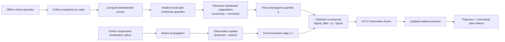

# Distributed Conformal Prediction for Cooperative Localization

## Motivation, Models, Algorithm, and Simulation Setup

Project context: class-conditional DCP + GS-CI cooperative localization in `multirobot_localization/`.

---

# Why Add Distributed Conformal Prediction (DCP)?

- Classical EKF/CI covariance can be miscalibrated under model mismatch and heterogeneous robot classes.
- CI handles unknown cross-correlation, but not statistical coverage of covariance ellipses.
- Conformal prediction adds finite-sample calibration of uncertainty using offline data.
- Distributed optimization removes the need for a centralized quantile server.
- Class-conditional calibration is needed because UGV/UAV dynamics and sensing are different.

---

# Core Idea

- Learn classwise uncertainty inflation factors \(q_c\) from calibration scores.
- Inflate covariance before communication/fusion:

\[
\tilde{\Sigma}_{i,t} = q_{c_i}\,\Sigma_{i,t}.
\]

- Use calibrated covariances inside GS-CI information fusion so uncertainty tubes are better aligned with observed errors.

---

# Assumptions Used in This Implementation

- Planar team state only in filters: stacked positions \(s\in\mathbb{R}^{2N}\).
- Orientation is tracked separately and used for kinematics/measurement linearization.
- Two hardware classes: `CLASS_A_UGV`, `CLASS_B_UAV`.
- Calibration data are generated offline and partitioned by class.
- One random post-burn-in snapshot per agent per episode for calibration dataset collection.
- Observation and communication graphs are random directed graphs sampled per rollout.

---

# Dynamics Model (Truth + Filter Propagation)

Truth robot update:
\[
\theta_{i,t+1}=\theta_{i,t}+\omega_{i,t}\Delta t,\quad
p_{i,t+1}=p_{i,t}+\Delta t
\begin{bmatrix}
\cos\theta_{i,t+1}\\
\sin\theta_{i,t+1}
\end{bmatrix}v_{i,t}.
\]

Filter mean update for own block \(ii=2i\):
\[
s_{ii,t+1}=s_{ii,t}+v_{i,t}\cos\theta_{i,t}\Delta t,\quad
s_{ii+1,t+1}=s_{ii+1,t}+v_{i,t}\sin\theta_{i,t}\Delta t.
\]

Covariance propagation:
- own block uses class-scaled process noise \(\texttt{var\_u\_v}\),
- other-agent blocks use unobserved-motion variance \(\texttt{var\_v}\).

---

# Sensing / Observation Models

Range-bearing measurement generator:
\[
d = \|p_j-p_i\| + \nu_d,\quad
\phi = \operatorname{atan2}(p_j-p_i) - \theta_i + \nu_\phi.
\]

Cartesianized observation used in EKF update:
\[
z =
\begin{bmatrix}
d\cos\phi\\
d\sin\phi
\end{bmatrix},\quad
\Sigma_z = R(\phi)\operatorname{diag}(\sigma_d^2,\; d^2\sigma_\phi^2)R(\phi)^\top.
\]

Standard EKF correction:
\[
K=\Sigma H^\top(H\Sigma H^\top+\Sigma_z)^{-1},\quad
s^+=s+K(z-\hat z),\quad
\Sigma^+=\Sigma-KH\Sigma.
\]

Both absolute-landmark and relative-robot updates are implemented.

---

# Communication Graph and Sampling

For \(N\) robots:

- Observation edges \((i\rightarrow j)\), \(j\in\{0,\dots,N\}\) (with \(j=N\) as landmark), sampled with probability \(p_{\text{obs}}\).
- Communication edges \((i\rightarrow j)\), \(i\neq j\), sampled with probability \(p_{\text{comm}}\).
- Edges are directed and re-sampled for each rollout.

Default simulation values:
- \(N=5\), landmark count \(M=1\),
- \(p_{\text{obs}}=0.7\), \(p_{\text{comm}}=0.2\).

---

# Offline Calibration and Nonconformity Scores

Per logged snapshot and agent \(i\), score is:
\[
r=\sqrt{(x_i-\mu_i)^\top \Sigma_i^\dagger (x_i-\mu_i)}.
\]

Split-conformal classwise quantile level:
\[
\tau = \min\!\left(1,\max\!\left(0,\frac{\lceil (n+1)(1-\alpha)\rceil}{n}\right)\right).
\]

Empirical quantile uses `higher` rule:
\[
\hat q = \operatorname{Quantile}_{\tau}^{\text{higher}}(\{r_k\}_{k=1}^n).
\]

---

# Distributed Classwise DCP Optimization

Run independently for each class \(c\):

1. Initialize each class member \(i\) with local split-conformal \(q_i^{(0)}\).
2. Build cycle-graph Metropolis mixing matrix \(W_c\).
3. Iterate for \(k=1,\dots,K\):
\[
m^{(k)} = W_c q^{(k-1)},
\]
\[
g_i^{(k)}=\frac{1}{|\mathcal S_i|}\sum_{r\in\mathcal S_i}\mathbf{1}\{r\le q_i^{(k-1)}\}-\tau_c,
\]
\[
q_i^{(k)}=\max\!\left(m_i^{(k)}-\frac{\eta_0}{\sqrt{k}}g_i^{(k)},\,10^{-6}\right).
\]

Final per-agent quantiles \(q_i\) are used to scale covariance in localization plots and communication update.

---

# GS-CI Communication with Class-Conditional Calibration

Before fusion:
\[
\tilde{\Sigma}_i=q_{c_i}\Sigma_i,\quad \tilde{\Sigma}_j=q_{c_j}\Sigma_j.
\]

Information form (with current implementation \(T_i^+=T_j^-=I\)):
\[
I_i=\tilde{\Sigma}_i^\dagger,\quad e_i=I_i s_i,\quad
I_{j\to i}=\tilde{\Sigma}_j^\dagger,\quad e_{j\to i}=I_{j\to i}s_j.
\]

CI fusion:
\[
I_i^+ = \beta I_i + (1-\beta)I_{j\to i},
\]
\[
\Sigma_i^+ = (I_i^+)^\dagger,\quad
s_i^+ = \Sigma_i^+\left(\beta e_i+(1-\beta)e_{j\to i}\right).
\]

Boundedness surrogate covariance uses \(q_{\sup}=\max_c q_c\) in the same CI-style information fusion.

---

# End-to-End Block Diagram



---

# Simulation Experiment Setup (Current Defaults)

Environment (`sim_env.py`):
- \(N=5\), \(M=1\), \(\Delta t=0.5\), \(d_{\max}=25\)
- \(v_{\max}=0.09\), \(\omega_{\max}=0.05\)
- Base noises: `var_u_v=(0.05^2)*max_v^2`, `var_v=2*4*max_v^2/12`, `var_dis=0.05^2`, `var_phi=(2/180)^2`

Class profiles:
- UGV: slower, lower sensing noise scales (`max_v_scale=0.7`, `range_var_scale=0.55`, `bearing_var_scale=0.50`)
- UAV: faster, higher sensing noise scales (`max_v_scale=2.4`, `range_var_scale=1.45`, `bearing_var_scale=1.60`)

Calibration dataset defaults:
- episodes \(=200\), steps \(=150\), burn-in \(=25\), seed \(=7\)
- class epsilons: UGV \(0.05\), UAV \(0.10\)

DCP + rollout defaults:
- rollout steps \(=500\), DCP steps \(=250\), DCP step size \(=0.35\), CI coefficient \(=0.8\), initial jitter std \(=0.25\)

---

# Reproducibility Commands and Outputs

Generate calibration data:

```bash
python multirobot_localization/collect_calibration_data.py \
  --output multirobot_localization/calibration_dataset.npz
```

Run DCP localization experiment:

```bash
python multirobot_localization/plot_dcp_localization.py \
  --calibration-dataset multirobot_localization/calibration_dataset.npz
```

Outputs in `multirobot_localization/output/`:
- `cooperative_localization_uncertainty_tubes.png`
- `dcp_quantiles_over_time.png`
- `cooperative_localization_dcp_metrics.npz`
